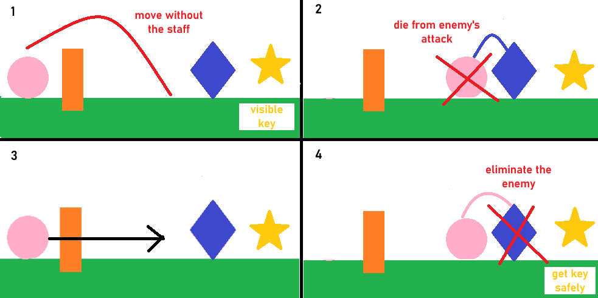
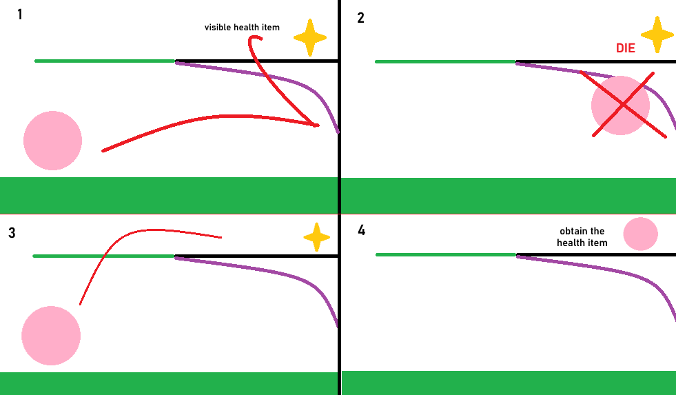

[](https://classroom.github.com/a/YyUO0xtt)
# COMP2150  - Level Design Document
### Name: Thanh Tra Tran
### Student number: 47649089

This document discusses and reflects on the design of your platformer level for the Level Design assessment. It should be 1500 words. Make sure you delete this and all other instructional text throughout the document before checking your word count prior to submission. Hint: You can check word count by copying this text into a Word or Google doc.

Your document must include images. To insert an image into your documentation, place it in the "DocImages" folder in this repo, then place the below text where you want the image to appear:

```

```

Example:


## 1. Player Experience (~700 words)
Outline and justify how your level design facilitates the core player experience goals outlined in the assignment spec. Each section should be supported by specific examples and screenshots of your game encounters that highlight design choices made to facilitate that particular experience.

### 1.1. Discovery
What does the player learn? How does your encounter and broader level design facilitate learning in a way that follows good design practice?
In general, the player would learn how to move and jump to avoid obstacles like acid, spikes and also the enemies (if they don't want to fight them). They would also learn to ultilize the weapons being given. For example, aside from using gun to shot the spitter, the gun can also be used to activate the one-time switch in puzzles. The player would also learn different type of platform and their mechanics like the moving platform or the move-through platform. To make all of the above feasible and interesting to play, I introduce more encounters as the player progres further into the game. No encounters are repeated and I also tried to have as least negative space as possible to avoid boredom. Scene 1 is put in the middle of the whole level and is connected to Scene 3 through Scene 2 so the player can naturally progress as how I intended without feeling forced. Scene 1 mostly introduce simple mechanics and easy encounters to teach players the basic of the game. Then as they move on to other scenes, more encounters are added along with enhanced difficulty. 


### 1.2. Drama
What is the intensity curve? How does your design facilitate increasing yet modulating intensity, with moments of tension and relief? 
The Intensity curve will go up quite quickly as the player progress through the level since the encounters are increased and negative spaces are minimized. The intensity curve will reach it peak when the player face the final challenge: Navigating through 3 moving platforms and deal with an active spitter to reach the key door. The curve will then significantly decrease as the player has landed safely to the key door section and there are no more challenges. For moments of relieve, i tend to put the checkpoints after the player has finished the main challenges of that level. Near the checkpoints are health pick up so that the player feel a sense of safety by giving them rewards. Except for the last Chomper at Scene 3, other enemies don't spawn after the player defeated them so the player can safely making tries to advance without having to worry about the extra annoyance from enemies. The majority of tension moments are placed in Scene 3, focusing on the path lead to the Scene and also the final section of it with the use of Moving platforms, making the player feel more intense everytime they have to make a jump. 


### 1.3. Challenge
What are the main challenges? How have you designed and balanced these challenges to control the difficulty curve and keep the player in the flow channel?
The main challenges are: Get by sections with acid safely, navigate through moving platforms, dealing with enemies and solving puzzles. To balance these challenges, I avoid combining too many of them in a small section so that the player don't get overwhelmed and feel underpowered while facing those challenges. If I combine many of these challenges, I make sure to put them together at the most basic level to ensure that after getting all the basic mechanics, the player can get through them after a few tries. For the scene 3, at the final section, I did put in alot of challenges such as adding more Moving platform while also increase the frequency of enemies, but managed to balance it out by placing more health pick-up and put in the checkpoint after the player manage to overcome most enemies. By balancing between risk and rewards, the player will feel more motivated to face optional challenges and keep the flow going by increasing the difficulty in a creative way.No encounters are too similar to make the player feel less repetitive and more immersive into the game world. 


### 1.4. Exploration
How does your level design facilitate autonomy and invite the player to explore? How do your aesthetic and layout choices create distinct and memorable spaces and/or places?
The Scene 1 and Scene 3 are connected together so to inspire the player to advance further into the level. I have made sure that player cannot enter Scene 3 from Scene 1, but Scene 3 are make obviously visible so that the player are encouraged to reach to the final section. In some sections, the player can chose their own way to move forward or to interact with certain object. The player can also pass through some encounters without having to fight the enemies. The main design and aesthetic goal is to create a small world that is packed with fun enounters. No spikes or acid section are placed randomly or solely for the aesthetic, but they instead act as a hidden hint to the player in which way to move. All the scenes are carefully connected to make the world feel immersive and related to each other, instead of just random sections that got put together to form a level. 


## 2. Core Gameplay (~400 words)
A section on Core Gameplay, where storyboards are used to outline how you introduce the player to each of the required gameplay elements in the first section of the game. Storyboards should follow the format provided in lectures.

Storyboards can be combined when multiple mechanics are introduced within a single encounter. Each section should include a sentence or two to briefly justify why you chose to introduce the mechanic/s to the player in that sequence.

You should restructure the headings below to match the order they appear in your level.

### 2.1. Weapon Pickup (Gun)

The gun can be used to attack enemies from long-range even before they start moving or when they start noticing the player. However, the gun has a limit of bullets available. 

### Encounter 1: 

### 2.2. Acid
The acid is placed so that the player think twice and act more careful before they make any jump. The acid is also used to increase the intensity the player feels between every jump. 
### 2.3. Moving Platforms
Moving platform are used to increase intensity since they require more thinking compared to normal unmoveable platform created by tiles. Upon reaching this platform, the player have to consider when to jump on, how long should they wait, when to jump off,etc thus create a sense of discovery. Even if the player failed to make the first jump, it would still act as a lesson so that they will get better in later tries . 
### 2.4. Spitters
The spitter urges the player to think and move faster so that they can avoid being hit by it. This enemy is used to create an early intensity and to introduce the player to the game's active enemies.
### 2.5. Checkpoints
The checkpoint is placed since this first encounter can be quite frustrating for many players, so the checkpoint make sure that they would not have to get through this tricky section again when they fell. This create a "safe space" for the player and encourage them to keep playing as they don't have to repeat a hard encounter multiple times just to advance. 

### Encounter 2: 

### 2.6. Weapon Pickup (Staff)
The staff can be used for close-range attack, and unlike the gun, it doesn't have any limit on how many time the player can use it. This is good for enemies like the Chomper, and can also be used to attack multiple enemies at once. Picking up the staff also means that the player is fully equipped for the journey ahead.  
### 2.7. Chompers
The chomper is placed so that the player can immediately see the use of the staff since if they don't defeat the chomper, they will have trouble obtaining the key. Placing the chomper here is to also introduce the player to a new type of enemy, what can it do and how to effectively defeat it. 
### 2.8. Keys
Key is placed after the player has finished a handful of challenges in this section. To get to the key, they must defeat or get around the chomper for additional challenge to increase the drama and keep the flow going. The player can advance further without the key, but they woule eventually have to comeback to get it as this is the most important item in each section. 

### Encounter 3:

### 2.9. Spikes
The spikes are used to create visible risks for the player, it make them rethink their route and indirectly hint which way to jump and which direction to move towards. In this case, it help showing the player where the passthrough platform is. 
### 2.10. Passthrough Platforms
Passthrough platform is used to make the game become more interesting, as the level now have an interactive platform that they can used in multiple way. To advance in sections with passthrough platform, the player must think out of the box to learn how to use this type of platform effectively.
### 2.11. Health Pickups
This is the final reward after the scene to make the player feel more statisfied and encouraged as their hard earn work is greatly reward and also motivated them to move to harder challenges as they just been a given another heart. If their hreats are full, the pick up box would not be opened so that they can comeback to obtain a heart whenever they need. 


## 3. Spatiotemporal Design
A section on Spatiotemporal Design, which includes your molecule diagram and annotated level maps (one for each main section of your level). These diagrams may be made digitally or by hand, but must not be created from screenshots of your game. The annotated level maps should show the structure you intend to build, included game elements, and the path the player is expected to take through the level. Examples of these diagrams are included in the level design lectures.

No additional words are necessary for this section (any words should only be within your images/diagrams).
 
### 3.1. Molecule Diagram


### 3.2. Level Map – Section 1


### 3.3.	Level Map – Section 2


### 3.4.	Level Map – Section 3


## 4. Iterative Design (~400 words)
Reflect on how iterative design helped to improve your level. Additional prototypes and design artefacts should be included to demonstrate that you followed an iterative design process (e.g. pictures of paper prototypes, early grey-boxed maps, additional storyboards of later gameplay sequences, etc.). You can also use this section to justify design changes made in Unity after you drew your level design maps shown in section 3. 

You should conclude by highlighting a specific example of an encounter, or another aspect of your level design, that could be improved through further iterative design.

Iterative design helped me to expand the game map further by adding in more challenges and fill negative spaces with meaningful encounters or pick-up items.Compared to the paper prototypes, the map are bigger and many encounters are improved to create connectivity and keep the flow going. Compared to the final work, the realy map is pretty basic and lack of a consistent increase in difficulty, which can lead to the player quitting mid level due to boredom. On the other hand, when I tried to trenmendously increase the challenges by adding more acid surfaces, moving platforms, new enemies into some encounters, they become near impossible to beat and take too many tries. The encounters are clearly challenging, but not challenging in a fun way, but rather appear to be very frustrating. After many play-testing attempt, I finally manage to balance the difficulty by designing more safe space along with make later encounter much harder, but not impossible to get through quickly once the player get the mechanics of them. 

Interative design is also greatly useful in balancing the game and keep the flow going without making the player feeling too bored or frustrated. Many encounters are improved after prototyping or play testing in terms of difficulty and enjoyability. Many of the encounters are redesigned after play-testing due to being too challenging or simply not just fun to play or might not inspire the player to continue playing. For instance, this encounter in Section 3 can be pretty boring and lower the intensity since it's simply just jumping on the moving platform and fight the chomper(optional). With iterative design, I belive this encounter can be much more interesting and challenging by adding new mechanics. Ideally, I can introduce a new problem solving puzzle since in the level, the puzzle solving are quite scarce and only appeared maybe once or twice in the 2 later sections. The puzzles are also pretty easy to solve and might not even take any tries, so adding harder puzzle will make the player more invested into the game and make their journey to reach to the Key Door more memorable. This will also make the Health pick-up become more valuable as the player must solve a hard puzzle and also beat a Chomper to be able to obtain this. 


## Generative AI Use Acknowledgement

Use the below table to indicate any Generative AI or writing assistance tools used in creating your document. Please be honest and thorough in your reporting, as this will allow us to give you the marks you have earnt. Place any drafts or other evidence inside this repository. This form and related evidence do not count to your word count.
An example has been included. Please replace this with any actual tools, and add more as necessary.


### Tool Used: ChatGPT
**Nature of Use** Finding relevant design theory.

**Evidence Attached?** Screenshot of ChatGPT conversation included in the folder "GenAI" in this repo.

**Additional Notes:** I used ChatGPT to try and find some more relevant design theory that I could apply to my game. After googling them, however, I found most of them were inaccurate, and some didn't exist. One theory mentioned, however, was useful, and I've incorporated it into my work.

### Tool Used: Example
**Nature of Use** Example Text

**Evidence Attached?** Example Text

**Additional Notes:** Example Text


